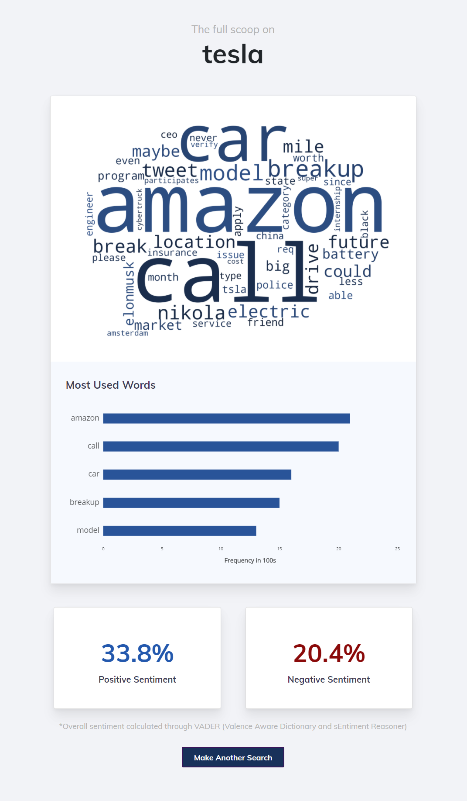

# Insight

Real-world company insights through Twitter data mining and natural language processing, served in an easy-to-use web application.



## How I made it

- Data mining: [twitterscraper](https://github.com/taspinar/twitterscraper)
- Natural Language Processing and data analysis: [nltk](https://github.com/nltk/nltk), [gensim](https://github.com/RaRe-Technologies/gensim), [numpy](https://github.com/numpy/numpy), [pandas](https://github.com/pandas-dev/pandas)
- Web application: [flask](https://github.com/pallets/flask), [bootstrap](https://github.com/twbs/bootstrap)

## Local setup

```shell
> git clone https://github.com/kadinzhang/Insight
> cd Insight
> python app.py
```
